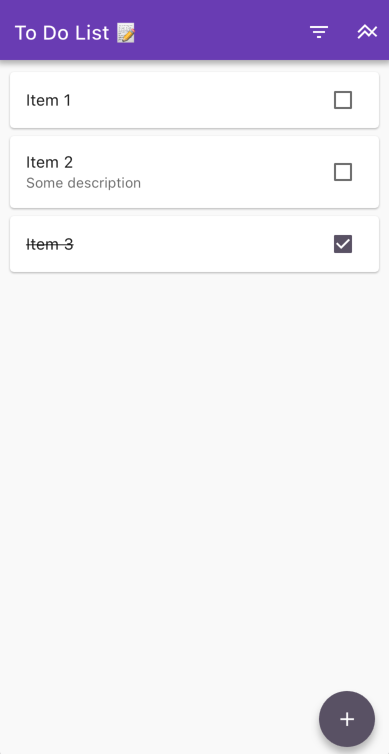
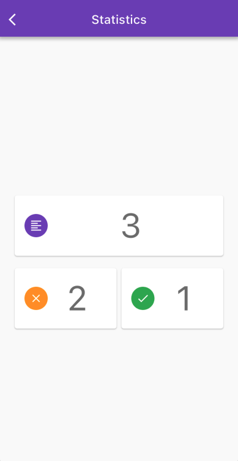

# To Do List

Simle To Do List using Flutter framework

# Screenshots

- 
- 

## Getting Started

Open Terminal
- `
git clone https://github.com/SidiqovAbbos/todo_app_gdg.git
`
- `cd todo_app-gdg`
- `flutter pud get`
- `flutter run`

# Q/A

- How to install Flutter?
  - https://flutter-ko.dev/get-started/install
- I have a problem on running the app.
  - Run `flutter doctor`, and check what was the wrong.

Create an issue, If you find any BUG 🪲

## Useful information

A few resources to get you started if this is your first Flutter project:

- [Lab: Write your first Flutter app](https://docs.flutter.dev/get-started/codelab)
- [Cookbook: Useful Flutter samples](https://docs.flutter.dev/cookbook)